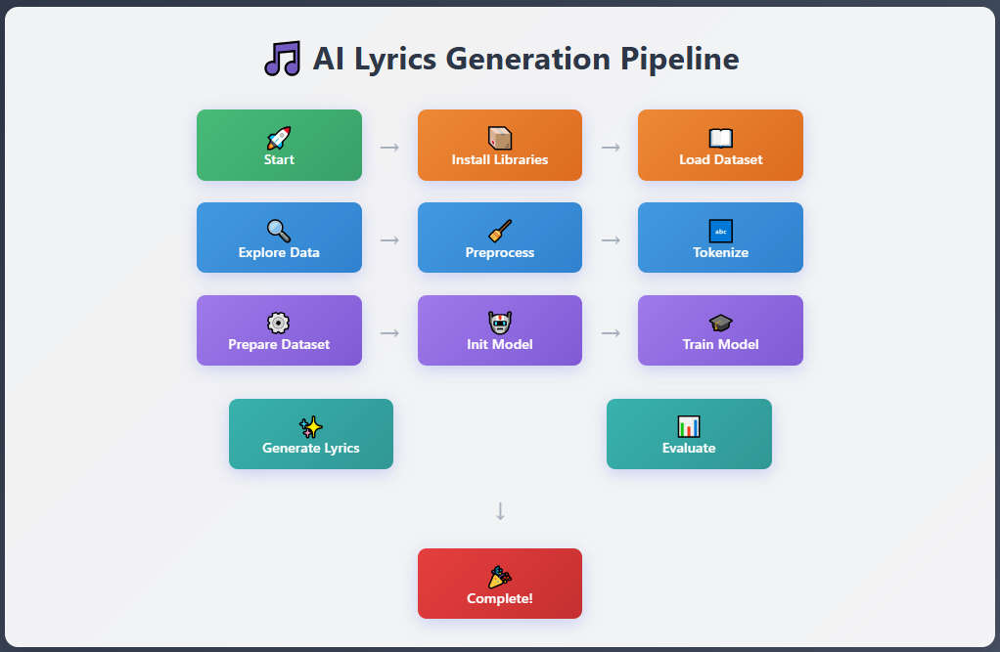
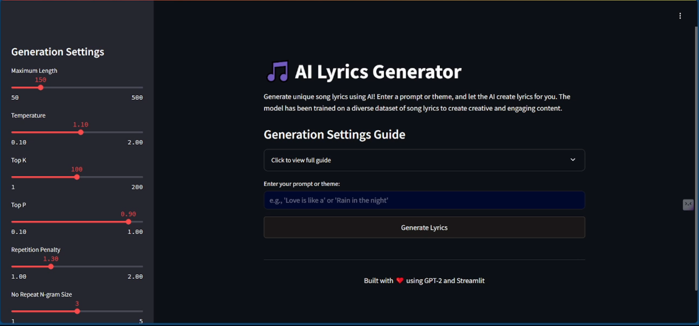

<h1 style="border-bottom: 2px solid #eee; padding-bottom: 10px; margin-bottom: 20px;">
        🎵 AI Lyrics Generator</h1>
<h2>Live link of Notebook - https://www.kaggle.com/code/svdhara/generate-lyrics</h2>

        This repository contains the code for an AI-powered lyrics generator built using the Hugging Face <code>transformers</code> library, Parameter-Efficient Fine-Tuning (PEFT) with LoRA, and a Streamlit web interface. The model, a fine-tuned GPT-2 medium, is capable of generating creative and engaging song lyrics based on a user-provided prompt or theme.

 

The project demonstrates:

<ul style="list-style-type: disc; margin-left: 20px;">
<li>Loading and preparing a large text dataset (Genius Lyrics).</li>
<li>Fine-tuning a pre-trained GPT-2 model with LoRA for efficient training.</li>
<li>Implementing multi-GPU training with <code>accelerate</code>.</li>
<li>Building a user-friendly web application with Streamlit for interactive lyric generation.</li>
</ul>

<h2 style="border-bottom: 1px solid #eee; padding-bottom: 5px; margin-top: 30px; margin-bottom: 15px;">
        🌟 Features
    </h2>
    <h3>Work Flow</h3>
    
  <h3>Inter Face </h3>
  
  
  <ul style="list-style-type: disc; margin-left: 20px;">
        <li><b>AI-Powered Generation</b>: Leverages a fine-tuned GPT-2 medium model for high-quality lyric generation.</li>
        <li><b>Customizable Output</b>: Adjust generation parameters like <code>max_length</code>, <code>temperature</code>, <code>top_k</code>, <code>top_p</code>, <code>repetition_penalty</code>, and <code>no_repeat_ngram_size</code> via the Streamlit interface.</li>
        <li><b>Efficient Fine-tuning</b>: Utilizes PEFT (LoRA) for memory-efficient training, making it feasible on consumer-grade GPUs.</li>
        <li><b>Multi-GPU Support</b>: Configured for distributed training using <code>accelerate</code> for faster fine-tuning on multiple GPUs (e.g., 2x T4 GPUs).</li>
        <li><b>User-Friendly Interface</b>: A simple and interactive Streamlit web application to generate and explore lyrics.</li>
    </ul>

<h2 style="border-bottom: 1px solid #eee; padding-bottom: 5px; margin-top: 30px; margin-bottom: 15px;">
        🚀 Getting Started
    </h2>
    

        Follow these steps to set up and run the Lyrics Generator.
    

<h3 style="margin-top: 20px; margin-bottom: 10px;">Prerequisites</h3>
    <ul style="list-style-type: disc; margin-left: 20px;">
        <li>Python 3.8+</li>
        <li><code>pip</code> package installer</li>
        <li>For GPU training, ensure you have compatible NVIDIA GPUs and CUDA installed.</li>
    </ul>

<h3 style="margin-top: 20px; margin-bottom: 10px;">Installation</h3>
    <ol style="list-style-type: decimal; margin-left: 20px;">
        <li>
            <b>Clone the repository (if applicable)</b>:
            <pre style="background-color: #f6f8fa; padding: 10px; border-radius: 5px; overflow-x: auto; font-family: 'SFMono-Regular', Consolas, 'Liberation Mono', Menlo, Courier, monospace;"><code>git clone https://github.com/your-username/lyrics-generator.git cd lyrics-generator</code></pre>
            

                <i>(If this is not a repository yet, you'd initialize one and add these files)</i>
            

        </li>
        <li>
            <b>Create a virtual environment (recommended)</b>:
            <pre style="background-color: #f6f8fa; padding: 10px; border-radius: 5px; overflow-x: auto; font-family: 'SFMono-Regular', Consolas, 'Liberation Mono', Menlo, Courier, monospace;"><code>python -m venv venv source venv/bin/activate  # On Windows: `venv\Scripts\activate`</code></pre>
        </li>
        <li>
            <b>Install the required packages</b>:
            <pre style="background-color: #f6f8fa; padding: 10px; border-radius: 5px; overflow-x: auto; font-family: 'SFMono-Regular', Consolas, 'Liberation Mono', Menlo, Courier, monospace;"><code>pip install transformers datasets evaluate peft accelerate bitsandbytes streamlit</code></pre>
        </li>
    </ol>

<h3 style="margin-top: 20px; margin-bottom: 10px;">Data Preparation</h3>
    <ol style="list-style-type: decimal; margin-left: 20px;">
        <li>
            <b>Download the dataset</b>:
            

                The notebook uses the <code>brunokreiner/genius-lyrics</code> dataset. This will be automatically downloaded by the <code>datasets</code> library. 
                The script then processes this into a <code>lyrics.txt</code> file.
            

            

                Make sure your <code>lyrics.txt</code> file is accessible at the path specified in <code>dataset_path</code> in your training script (e.g., <code>/kaggle/working/lyrics.txt</code> if running in Kaggle, or adjust to a local path). The notebook includes a mechanism to create a dummy <code>lyrics.txt</code> if it's not found for demonstration purposes.
            

            <pre style="background-color: #f6f8fa; padding: 10px; border-radius: 5px; overflow-x: auto; font-family: 'SFMono-Regular', Consolas, 'Liberation Mono', Menlo, Courier, monospace;"><code># Example from the notebook to create lyrics.txt (if not already done) # Ensure this part of your notebook is run or manually create `lyrics.txt` # from your desired lyrics data. # The original notebook uses: # lyrics_l = dataset["train"]["lyrics"].loc[dataset["train"]["is_english"] == True] # with open(file_path, "w") as file: #     for item in lyrics_l[:80000]: # Adjust limit as needed #         file.write(str(item) + "\n")</code></pre>
        </li>
    </ol>

<h3 style="margin-top: 20px; margin-bottom: 10px;">Model Training</h3>
    

        The training process is designed for both single and multi-GPU setups.
    

<h4 style="margin-top: 15px; margin-bottom: 8px;">Single GPU / CPU Training</h4>
    

        To train on a single GPU or CPU, simply run the Jupyter notebook <code>lyrics-generator.ipynb</code> or execute the Python script derived from it directly.
    

    <pre style="background-color: #f6f8fa; padding: 10px; border-radius: 5px; overflow-x: auto; font-family: 'SFMono-Regular', Consolas, 'Liberation Mono', Menlo, Courier, monospace;"><code>python your_training_script.py # if you converted the notebook to a .py file</code></pre>

<h4 style="margin-top: 15px; margin-bottom: 8px;">Multi-GPU Training (Recommended for faster training)</h4>
    

        For multi-GPU training, you'll need to use the <code>accelerate</code> CLI.
    

    <ol style="list-style-type: decimal; margin-left: 20px;">
        <li>
            <b>Save the Jupyter notebook as a Python script</b>:
            

                Save <code>lyrics-generator.ipynb</code> as <code>train_lyrics.py</code>. You can usually do this from your Jupyter environment (File -> Download as -> Python (.py)).
            

        </li>
        <li>
            <b>Configure Accelerate</b>:
            

                Open your terminal and run:
            

            <pre style="background-color: #f6f8fa; padding: 10px; border-radius: 5px; overflow-x: auto; font-family: 'SFMono-Regular', Consolas, 'Liberation Mono', Menlo, Courier, monospace;"><code>accelerate config</code></pre>
            

                Follow the prompts. Key choices for a 2x T4 GPU setup would be:
            

            <ul style="list-style-type: circle; margin-left: 20px;">
                <li><code>How many machines are you using?</code> <code>1</code></li>
                <li><code>Do you want to use Distributed Data Parallel?</code> <code>yes</code></li>
                <li><code>How many GPUs you want to use on this machine?</code> <code>2</code> (or the number detected)</li>
                <li><code>What is your compute type?</code> <code>fp16</code> (if <code>fp16 = True</code> in the configuration) or <code>no</code> (if <code>fp16 = False</code>)</li>
                <li>For other options, you can generally leave them as default.</li>
            </ul>
        </li>
        <li>
            <b>Run the training script</b>:
            <pre style="background-color: #f6f8fa; padding: 10px; border-radius: 5px; overflow-x: auto; font-family: 'SFMono-Regular', Consolas, 'Liberation Mono', Menlo, Courier, monospace;"><code>accelerate launch train_lyrics.py</code></pre>
            

                The fine-tuned model will be saved in the <code>./lyrics_generator_finetuned</code> directory (or the <code>output_dir</code> specified in your script).
            

        </li>
    </ol>

<h3 style="margin-top: 20px; margin-bottom: 10px;">Running the Streamlit Application</h3>
    

        The Streamlit application provides an interactive interface for generating lyrics.
    

    <ol style="list-style-type: decimal; margin-left: 20px;">
        <li>
            <b>Ensure <code>app.py</code> is created</b>:
            

                The Jupyter notebook includes a cell that writes the <code>app.py</code> file. Make sure this cell has been executed, or manually create <code>app.py</code> with the content provided in the notebook's <code>%%writefile app.py</code> cell.
            

        </li>
        <li>
            <b>Ensure model checkpoint is available</b>:
            

                The <code>app.py</code> expects the fine-tuned model checkpoint at <code>/kaggle/input/finetune/checkpoint-4920</code>. <b>You will need to adjust this path</b> in <code>app.py</code> to where your fine-tuned model (from the training step) is actually saved. If you trained locally, it would likely be <code>./lyrics_generator_finetuned</code>.
            

            

                <b>Edit <code>app.py</code> line 118 (approx):</b>
            

            <pre style="background-color: #f6f8fa; padding: 10px; border-radius: 5px; overflow-x: auto; font-family: 'SFMono-Regular', Consolas, 'Liberation Mono', Menlo, Courier, monospace;"><code>model_path = "/path/to/your/fine-tuned/model/checkpoint" # e.g., "./lyrics_generator_finetuned"</code></pre>
        </li>
        <li>
            <b>Run the Streamlit app</b>:
            <pre style="background-color: #f6f8fa; padding: 10px; border-radius: 5px; overflow-x: auto; font-family: 'SFMono-Regular', Consolas, 'Liberation Mono', Menlo, Courier, monospace;"><code>streamlit run app.py</code></pre>
            

                This will start the Streamlit server, and a local URL (e.g., <code>http://localhost:8501</code>) will be displayed in your terminal. Open this URL in your web browser.
            

        </li>
    </ol>

<h2 style="border-bottom: 1px solid #eee; padding-bottom: 5px; margin-top: 30px; margin-bottom: 15px;">
        ⚙️ Configuration
    </h2>
    

        Key configurations can be found within the <code>lyrics-generator.ipynb</code> (or <code>train_lyrics.py</code>) and <code>app.py</code> files:
    

<h4 style="margin-top: 15px; margin-bottom: 8px;"><code>lyrics-generator.ipynb</code> / <code>train_lyrics.py</code> (Training Configuration)</h4>
    <pre style="background-color: #f6f8fa; padding: 10px; border-radius: 5px; overflow-x: auto; font-family: 'SFMono-Regular', Consolas, 'Liberation Mono', Menlo, Courier, monospace;"><code># Model Configuration model_name = "gpt2-medium" output_dir = "./lyrics_generator_finetuned"  # Dataset Configuration dataset_path = "/kaggle/working/lyrics.txt" # Adjust this to your actual lyrics file path val_split = 0.1  # Training Configuration block_size = 256 batch_size = 16 grad_accum = 8 epochs = 5 learning_rate = 5e-5  # Optimization Configuration use_peft = True lora_r = 16 lora_alpha = 32 lora_dropout = 0.05 use_4bit = False fp16 = True gradient_checkpointing = True  # Generation Configuration (for testing after training) prompt = "Love is like a" max_new_tokens = 100 temperature = 1.2 top_k = 50 top_p = 0.95</code></pre>

<h4 style="margin-top: 15px; margin-bottom: 8px;"><code>app.py</code> (Streamlit Application Parameters)</h4>
    

        The Streamlit app exposes these parameters as sliders in the sidebar for real-time adjustment:
    

    <ul style="list-style-type: disc; margin-left: 20px;">
        <li><code>Maximum Length</code></li>
        <li><code>Temperature</code></li>
        <li><code>Top K</code></li>
        <li><code>Top P</code></li>
        <li><code>Repetition Penalty</code></li>
        <li><code>No Repeat N-gram Size</code></li>
    </ul>

<h2 style="border-bottom: 1px solid #eee; padding-bottom: 5px; margin-top: 30px; margin-bottom: 15px;">
        🤝 Contributing
    </h2>
    

        Contributions are welcome! If you'd like to improve the lyrics generator, feel free to <a href="https://github.com/your-username/lyrics-generator/fork" target="_blank" rel="noopener noreferrer">fork the repository</a>, make your changes, and submit a pull request.
    

<h2 style="border-bottom: 1px solid #eee; padding-bottom: 5px; margin-top: 30px; margin-bottom: 15px;">
        📄 License
    </h2>
    

        This project is licensed under the <a href="https://www.apache.org/licenses/LICENSE-2.0" target="_blank" rel="noopener noreferrer">Apache 2.0 License</a>. See the <code>LICENSE</code> file for details.
    

<h2 style="border-bottom: 1px solid #eee; padding-bottom: 5px; margin-top: 30px; margin-bottom: 15px;">
        🙏 Acknowledgements
    </h2>
    <ul style="list-style-type: disc; margin-left: 20px;">
        <li>Hugging Face <code>transformers</code> and <code>peft</code> libraries for making advanced NLP models accessible.</li>
        <li><a href="https://huggingface.co/datasets/brunokreiner/genius-lyrics" target="_blank" rel="noopener noreferrer">brunokreiner/genius-lyrics</a> dataset on Hugging Face.</li>
        <li>Streamlit for the intuitive web application framework.</li>
    </ul>

